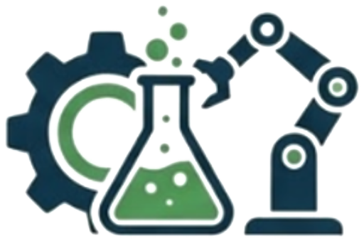
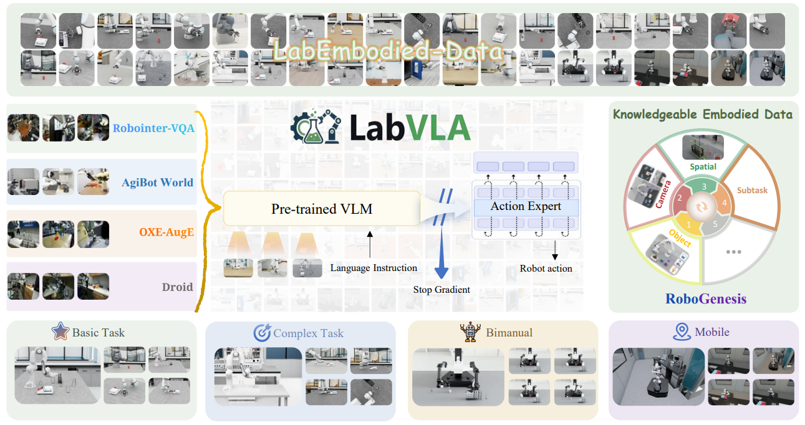

<div align="center">

<p align="center">
  
  
</p>

<h3 align="center"> The First Vision-Language-Action Foundation Model for Scientific Laboratories </h3>

</div>

<div align="center">
  
</div>

<p align="center">
  
</p>

<div align="center">

  <a href='https://github.com/zjunlp/LabVLA'>
    
  </a>

  <a href='https://huggingface.co/zjunlp/LabVLA'>
    
  </a>

  <a href='https://zjunlp.github.io/LabVLA/'>
    
  </a>

  <a href='https://arxiv.org/abs/2606.13578'>
    
  </a>

  <a href='https://huggingface.co/papers/2606.13578'>
    
  </a>

  <a href="https://github.com/zjunlp/LabVLA/stargazers">
    
  </a>

  <a href="https://github.com/zjunlp/LabVLA/blob/main/LICENSE">
    
  </a>

</div>

<div align="center">
  <div style="width: 100%; height: 2px; margin: 20px 0; background: linear-gradient(90deg, transparent, #00d9ff, transparent);"></div>
</div>

**LabVLA** turns a **Qwen3-VL-4B-Instruct** vision–language backbone into a real-time robot controller through a **DiT flow-matching action expert**, trained with the π0.5 recipe: FAST action-token pre-training → flow-matching post-training with knowledge insulation → task fine-tuning. This README covers **installation and deployment** — method details are in the [paper](#-citation).

> **Note:** This repository currently ships **inference & deployment** only. The full training and fine-tuning code is being organized and will be released soon — see [TODO](#-todo).

<div align="center">

[✨ Features](#-features) • [📋 TODO](#-todo) • [📦 Installation](#-installation) • [🚀 Quick Start](#-quick-start) • [📡 Deployment](#-deployment) • [📝 Citation](#-citation)

</div>

---

## ✨ Features

**🎓 The recipe — every stage in one framework**

| Mode | What it does |
|---|---|
| **VLM pre-training** | FAST action-token cross-entropy on the VLM backbone. |
| **Flow-matching post-training** | Trains the DiT action expert to generate 50-step continuous action chunks. |
| **Knowledge Isolation (KI)** | Stop-gradient between VLM and action expert. |
| **Task fine-tuning** | Fine-tuning for downstream tasks. |
| **Multi-dataset & VQA co-training** | π0-style mixture with homogeneous batches. |
| **delta / abs action modes** | Per-dimension `delta_mask` — arm joints delta, gripper absolute, in one vector. |

**⚙️ Engineering**

- 🚀 **Efficiency** — selective gradient checkpointing (only a subset of modules — e.g. visual encoder or language model — is checkpointed per stage), Liger-Kernel fused ops, DeepSpeed ZeRO-2, and EMA offload together keep per-GPU batch size at **64 on 80 GB A100** with minimal speed penalty.

| Stage | A100 80 GB | BS / GPU | Global BS | ~ s / step |
|---|---|---|---|---|
| VLM Pre-training | 24 (3 × 8) | 64 | 1 536 | ≈ 7 |
| KI Post-training | 16 (2 × 8) | 64 | 1 024 | ≈ 5 |
| Task Fine-tuning | 4 | 48 | 192 | ≈ 3 |

---

## 📋 TODO

- [x] Model weights on Hugging Face
- [x] Inference & deployment code
- [ ] **Training & fine-tuning code** — *coming soon (being organized)*
- [ ] Data processing pipeline — *coming soon*

We are actively organizing the training code and will release it soon. Stay tuned!

---

## 📦 Installation

**Python 3.10 · CUDA 12.6 · PyTorch 2.7.1** — pinned versions in [`requirements.txt`](requirements.txt).

```bash
conda create -n labvla python=3.10 -y && conda activate labvla

# 1. PyTorch (CUDA 12.6)  →  2. FlashAttention (built against it)  →  3. everything else
pip install torch==2.7.1 torchvision==0.22.1 --index-url https://download.pytorch.org/whl/cu126
pip install flash_attn==2.8.3 --no-build-isolation
pip install -r requirements.txt
```

---

## 🚀 Quick Start

**1. Download** the model from Hugging Face:

```bash
huggingface-cli download zjunlp/LabVLA --local-dir LabVLA
```

**2. Deploy** — start a WebSocket inference server:

```bash
PRETRAINED_PATH=/path/to/LabVLA bash deployment/deploy.sh
```

**3. Evaluate** — connect your robot or simulator client to the server and run rollouts. See [Deployment](#-deployment) for configuration details.

---

## 📡 Deployment

Download [LabVLA](https://huggingface.co/zjunlp/LabVLA) from Hugging Face, then deploy via the script:

```bash
bash deployment/deploy.sh
```

---

## 📝 Citation

```bibtex
@article{ren2026labvla,
  title   = {LabVLA: Grounding Vision-Language-Action Models in Scientific Laboratories},
  author  = {Ren, Baochang and Liu, Xinjie and Chen, Xi and Liu, Yanshuo and
             Li, Chenxi and Gao, Daqi and Su, Zeqin and Xing, Jintao and
             Xue, Zirui and Li, Rui and Zhao, Xiangyu and Qiao, Shuofei and
             Pan, Minting and Zuo, Wangmeng and Bai, Lei and Zhou, Dongzhan and
             Zhang, Ningyu and Chen, Huajun},
  journal = {arXiv preprint arXiv:2606.13578},
  year    = {2026}
}
```

## 🙏 Acknowledgments

Our codebase references [LeRobot](https://github.com/huggingface/lerobot) and [Liger-Kernel](https://github.com/linkedin/Liger-Kernel). We sincerely thank their teams for the outstanding contributions to the open-source community.
